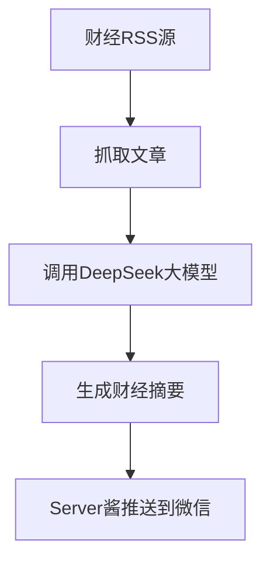

# 📈 FinNewsCollectionBot · 每日财经速递

**为专业投资者打造的智能财经资讯助手**

[](https://github.com/sgrsun3/FinNewsCollectionBot/actions/workflows/rss-bot.yml)


---
## 🧧 支持作者 · 让项目持续进化！

如果本项目对你有帮助，欢迎打赏支持，资助我多喝几杯咖啡 ☕，跑更多模型 💻～

- 💬 微信号：`Jingxh0708`
- 🙌 感谢每一位 Star、Fork 和支持者！

> ✨ 金融爸爸一块钱我不嫌少，一百块我也不嫌多 😊
---

## 🎯 项目简介

FinNewsCollectionBot 是一款为券商分析师、基金经理、研究员等专业投资人量身打造的**财经资讯智能摘要助手**。

它自动聚合主流财经媒体的 RSS 信息源，并调用 **DeepSeek 大语言模型**，每天两次推送核心财经摘要，帮助你快速掌握全球市场动态、产业趋势与政策走向。

---

## 🚀 核心功能

- ⏰ **每日两次自动摘要推送**  
  每天上午 09:00、下午 17:00 定时运行，生成分析报告

- 🌐 **多源财经 RSS 聚合**  
  支持华尔街见闻、36氪、东方财富、华尔街日报、BBC 等主流财经媒体

- 🧠 **大模型深度分析**  
  使用 DeepSeek 大语言模型自动提炼财经新闻的核心内容与趋势判断

- 📲 **微信即时推送**  
  集成 Server 酱服务，生成的财经摘要自动推送至你的微信

---

## 🧑‍💻 技术栈

- Python
- feedparser + newspaper3k
- DeepSeek 大语言模型 API
- GitHub Actions 自动定时部署

---

## 🔧 快速开始（快速部署）

1. **Fork 本项目**
2. 配置你的 RSS 源地址和 DeepSeek API Key
3. 在 GitHub 中设置 Secrets：
   ```bash
   OPENAI_API_KEY=your_deepseek_api_key
   SERVER_CHAN_KEYS=your_serverchan_key
   ```
4. 自动触发 GitHub Actions 开始运行

📌 成功部署后，每天两次财经摘要将自动生成并推送到你的微信！

### ▶️ 我已经配好两个密钥，下一步怎么让它跑起来？

你可以用下面两种方式：

**方式 A：立刻手动触发（推荐先验证一次）**
1. 打开你的仓库页面 → `Actions`。
2. 进入工作流 **"📡 RSS 财经新闻自动推送"**。
3. 点击 **Run workflow**，选择分支后执行。
4. 等待 1-5 分钟，在日志中看到 `🚀 运行脚本` 成功后，查看微信是否收到推送。

**方式 B：等定时任务自动执行**
- 工作流默认每天北京时间 **09:00** 和 **17:00** 自动运行。

如果你想在本地先测试（不会影响 GitHub 定时任务）：
```bash
pip install -r requirements.txt
export OPENAI_API_KEY=你的模型Key
export SERVER_CHAN_KEYS=你的Server酱SendKey
python financebot.py
```

---

## 🔐 API Key 安全与配置说明

### 1) 这个仓库会泄露我的 API Key 吗？

默认**不会**，前提是你按下面方式使用：

- 不要把 Key 直接写进 `financebot.py` 等代码文件；
- 只在 GitHub 仓库的 **Settings → Secrets and variables → Actions** 中配置；
- 在日志、Issue、截图中避免暴露完整 Key。

本项目读取的是环境变量：

- `OPENAI_API_KEY`（用于大模型接口）
- `SERVER_CHAN_KEYS`（一个或多个 Server 酱 SendKey，逗号分隔）

### 2) 两个 API Key 从哪里获取？

- `SERVER_CHAN_KEYS`：到 **Server 酱（sct.ftqq.com）** 注册并获取 SendKey；
- `OPENAI_API_KEY`：当前默认按 **DeepSeek OpenAI 兼容接口**配置，去 DeepSeek 开放平台创建 API Key。

### 3) 可以直接用 Server 酱 + 阿里模型吗？

- **Server 酱可以直接用**（本项目就是按它的接口发送微信推送）；
- **阿里模型不一定能直接用**，取决于是否提供 OpenAI 兼容调用方式。

当前代码固定了：

- `base_url="https://api.deepseek.com/v1"`
- `model="deepseek-chat"`

如果你要换成阿里模型，需要把 `base_url` 和 `model` 改成阿里平台对应参数，并把 `OPENAI_API_KEY` 换成阿里平台发放的 Key。

### 4) 推荐安全实践

- 建议新建专用子账号 Key（最小权限）；
- 设置调用额度上限，定期轮换 Key；
- Key 一旦泄露，立刻在服务商后台吊销并重建。

---

## 🔐 API Key 安全与配置说明

### 1) 这个仓库会泄露我的 API Key 吗？

默认**不会**，前提是你按下面方式使用：

- 不要把 Key 直接写进 `financebot.py` 等代码文件；
- 只在 GitHub 仓库的 **Settings → Secrets and variables → Actions** 中配置；
- 在日志、Issue、截图中避免暴露完整 Key。

本项目读取的是环境变量：

- `OPENAI_API_KEY`（用于大模型接口）
- `SERVER_CHAN_KEYS`（一个或多个 Server 酱 SendKey，逗号分隔）

### 2) 两个 API Key 从哪里获取？

- `SERVER_CHAN_KEYS`：到 **Server 酱（sct.ftqq.com）** 注册并获取 SendKey；
- `OPENAI_API_KEY`：当前默认按 **DeepSeek OpenAI 兼容接口**配置，去 DeepSeek 开放平台创建 API Key。

### 3) 可以直接用 Server 酱 + 阿里模型吗？

- **Server 酱可以直接用**（本项目就是按它的接口发送微信推送）；
- **阿里模型不一定能直接用**，取决于是否提供 OpenAI 兼容调用方式。

当前代码固定了：

- `base_url="https://api.deepseek.com/v1"`
- `model="deepseek-chat"`

如果你要换成阿里模型，需要把 `base_url` 和 `model` 改成阿里平台对应参数，并把 `OPENAI_API_KEY` 换成阿里平台发放的 Key。

### 4) 推荐安全实践

- 建议新建专用子账号 Key（最小权限）；
- 设置调用额度上限，定期轮换 Key；
- Key 一旦泄露，立刻在服务商后台吊销并重建。

---

## 💼 使用场景

- 券商/基金公司/研究所自动生成投资快报
- 金融从业者日常资讯监测
- 个人投资者快捷了解宏观政策/产业热点
- 财经内容运营/财经公众号 AI 辅助创作

---

## 📌 示例流程图



---

## 🛠️ 后续规划

- ✅ 增加更多 RSS 财经数据源
- ✅ 引入情绪分析与金融事件检测
- ⏳ 支持多语言财经摘要生成
- ⏳ 构建简洁前端页面用于非技术用户管理配置

---

## 🤝 欢迎参与

📬 欢迎 Star ⭐ / Fork 🍴 / PR 💡 本项目，一起共建更智能的财经决策工具。

你也可以通过 Issues 留言建议功能，或私信我交流使用体验～

---

此项目Fork于sgrsun3，感谢原作者

---

© 2025 jxh1997 | MIT License
